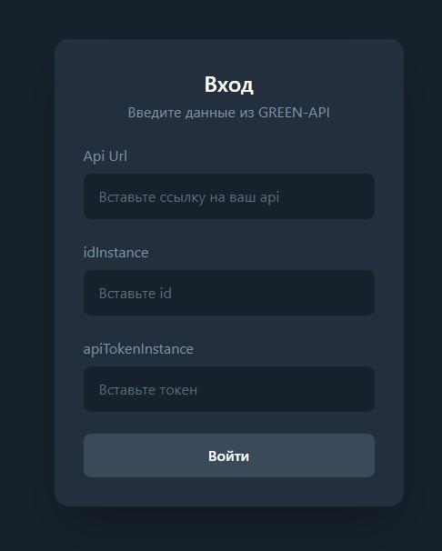
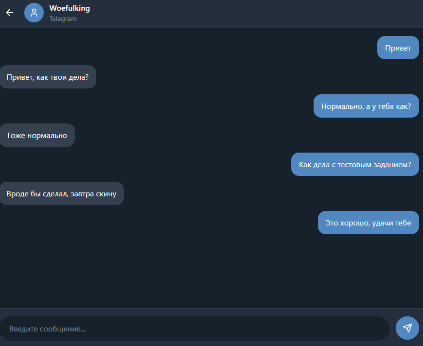

# Green API Telegram Chat

Тестовое задание на React для реализации простого интерфейса обмена текстовыми сообщениями через Green API (Telegram).

## Реализованные возможности

- Авторизация по apiUrl, idInstance и apiTokenInstance.
- Создание чата по номеру телефона.
- Отправка текстовых сообщений.
- Получение входящих сообщений через ReceiveNotification.
- Удаление обработанных уведомлений (DeleteNotification).
- Автоматическая прокрутка чата к последнему сообщению.

## Используемые технологии

- React
- TypeScript
- React Router
- Tailwind CSS
- Green API (Telegram)

## Запуск проекта

Скопировать репозиторий

```bash
git clone https://github.com/Woefulking/GreenApi.git
cd GreenApi
```

Установить зависимости

```bash
npm install
```

Запустить проект

```bash
npm run dev
```

## Скриншоты




